# OmniRoute MCP Server Documentation

> Model Context Protocol server with 37 tools across routing, cache, compression, memory, skills, and proxy operations.
>
> Source of truth: `open-sse/mcp-server/schemas/tools.ts` (30 tools) + `open-sse/mcp-server/tools/memoryTools.ts` (3 tools) + `open-sse/mcp-server/tools/skillTools.ts` (4 tools). Tool registration and scope wiring lives in `open-sse/mcp-server/server.ts`.



> Source: [diagrams/mcp-tools-37.mmd](../diagrams/mcp-tools-37.mmd)

## Installation

OmniRoute MCP is built-in. Start it with:

```bash
omniroute --mcp
```

Or via the open-sse transport:

```bash
# HTTP streamable transport (port 20130)
omniroute --dev  # MCP auto-starts on /mcp endpoint
```

## Transports

The MCP server exposes three transports, all backed by the same `createMcpServer()` factory:

| Transport         | Where                                       | When to use                                          |
| :---------------- | :------------------------------------------ | :--------------------------------------------------- |
| `stdio`           | `open-sse/mcp-server/server.ts`             | IDE integrations (Claude Desktop, Cursor, etc.)      |
| `sse`             | `POST/GET /api/mcp/sse` via `httpTransport` | Browser/agent clients that need an event stream      |
| `streamable-http` | `POST/GET/DELETE /api/mcp/stream`           | Multi-session HTTP clients (`mcp-session-id` header) |

The active HTTP transport (`sse` or `streamable-http`) is selected by the `mcpTransport` setting. Switching transports closes existing sessions on the other transport.

## IDE Configuration

See [MCP Client Configuration](../guides/SETUP_GUIDE.md#mcp-client-configuration) for Claude Desktop,
Cursor, Cline, and compatible MCP client setup.

---

## Essential Tools (8) — Phase 1

| Tool                            | Scopes                | Description                                                   |
| :------------------------------ | :-------------------- | :------------------------------------------------------------ |
| `omniroute_get_health`          | `read:health`         | Uptime, memory, circuit breakers, rate limits, cache stats    |
| `omniroute_list_combos`         | `read:combos`         | All configured combos with strategies (optional metrics)      |
| `omniroute_get_combo_metrics`   | `read:combos`         | Performance metrics for a specific combo                      |
| `omniroute_switch_combo`        | `write:combos`        | Activate or deactivate a combo                                |
| `omniroute_check_quota`         | `read:quota`          | Quota used/total, percent remaining, reset time, token health |
| `omniroute_route_request`       | `execute:completions` | Send a chat completion through OmniRoute routing              |
| `omniroute_cost_report`         | `read:usage`          | Cost report by period (session/day/week/month)                |
| `omniroute_list_models_catalog` | `read:models`         | Full model catalog with capabilities, status, pricing         |

## Phase 1 — Search

| Tool                   | Scopes           | Description                                                                                                                        |
| :--------------------- | :--------------- | :--------------------------------------------------------------------------------------------------------------------------------- |
| `omniroute_web_search` | `execute:search` | Web search through OmniRoute search gateway (Serper/Brave/Perplexity/Exa/Tavily/Google PSE/Linkup/SearchAPI/SearXNG) with failover |

## Advanced Tools (11) — Phase 2

| Tool                               | Scopes                               | Description                                                                               |
| :--------------------------------- | :----------------------------------- | :---------------------------------------------------------------------------------------- |
| `omniroute_simulate_route`         | `read:health`, `read:combos`         | Dry-run routing simulation with fallback tree                                             |
| `omniroute_set_budget_guard`       | `write:budget`                       | Session budget with degrade/block/alert action                                            |
| `omniroute_set_routing_strategy`   | `write:combos`                       | Update combo strategy at runtime (priority/weighted/auto/etc.)                            |
| `omniroute_set_resilience_profile` | `write:resilience`                   | Apply `aggressive` / `balanced` / `conservative` resilience preset                        |
| `omniroute_test_combo`             | `execute:completions`, `read:combos` | Live test of every provider in a combo using a real upstream call                         |
| `omniroute_get_provider_metrics`   | `read:health`                        | Per-provider metrics with p50/p95/p99 latency and circuit breaker state                   |
| `omniroute_best_combo_for_task`    | `read:combos`, `read:health`         | Recommend combo by task type with budget/latency constraints                              |
| `omniroute_explain_route`          | `read:health`, `read:usage`          | Explain why a request was routed to a provider (scoring factors + fallbacks)              |
| `omniroute_get_session_snapshot`   | `read:usage`                         | Full session snapshot: cost, tokens, top models/providers, errors, budget guard           |
| `omniroute_db_health_check`        | `read:health`, `write:resilience`    | Diagnose (and optionally auto-repair) database drift like broken combo refs / orphan rows |
| `omniroute_sync_pricing`           | `pricing:write`                      | Sync pricing data from external sources (LiteLLM); supports `dryRun`                      |

## Cache Tools (2)

| Tool                    | Scopes        | Description                                         |
| :---------------------- | :------------ | :-------------------------------------------------- |
| `omniroute_cache_stats` | `read:cache`  | Semantic cache, prompt-cache, and idempotency stats |
| `omniroute_cache_flush` | `write:cache` | Flush cache globally or by signature/model          |

## Compression Tools (5)

| Tool                                | Scopes              | Description                                                                                                              |
| :---------------------------------- | :------------------ | :----------------------------------------------------------------------------------------------------------------------- |
| `omniroute_compression_status`      | `read:compression`  | Compression settings, analytics summary, and cache-aware stats (includes `analytics.mcpDescriptionCompression` metadata) |
| `omniroute_compression_configure`   | `write:compression` | Configure compression mode, threshold, target ratio, system-prompt preservation, MCP description compression toggle      |
| `omniroute_set_compression_engine`  | `write:compression` | Pick the active engine (off/caveman/rtk/stacked) and Caveman/RTK intensity                                               |
| `omniroute_list_compression_combos` | `read:compression`  | List named compression combos and their engine pipelines                                                                 |
| `omniroute_compression_combo_stats` | `read:compression`  | Analytics grouped by compression combo and engine                                                                        |

`omniroute_compression_status` reports MCP description compression separately under
`analytics.mcpDescriptionCompression`. Those values are metadata-size estimates for MCP listable
descriptions (`tools`, `prompts`, `resources`, and `resourceTemplates`); they are not provider usage
receipts and are marked with `source: "mcp_metadata_estimate"`.

See [Compression Engines](../compression/COMPRESSION_ENGINES.md) and [RTK Compression](../compression/RTK_COMPRESSION.md) for
the runtime compression model behind these tools.

## 1Proxy Tools (3)

| Tool                        | Scopes         | Description                                                                             |
| :-------------------------- | :------------- | :-------------------------------------------------------------------------------------- |
| `omniroute_oneproxy_fetch`  | `read:proxies` | Fetch free proxies from the 1proxy marketplace (protocol/country/quality/limit filters) |
| `omniroute_oneproxy_rotate` | `read:proxies` | Get the next available proxy by strategy (`random` / `quality` / `sequential`)          |
| `omniroute_oneproxy_stats`  | `read:proxies` | Pool stats, sync status, distribution by protocol and country                           |

## Memory Tools (3)

Defined in `open-sse/mcp-server/tools/memoryTools.ts`. Auth/scope is enforced through the standard MCP scope pipeline.

| Tool                      | Description                                                                         |
| :------------------------ | :---------------------------------------------------------------------------------- |
| `omniroute_memory_search` | Search memories by query / type / API key with token-budget enforcement             |
| `omniroute_memory_add`    | Add a new memory entry (`factual` / `episodic` / `procedural` / `semantic`)         |
| `omniroute_memory_clear`  | Clear memories for an API key, optionally filtered by type or `olderThan` timestamp |

## Skill Tools (4)

Defined in `open-sse/mcp-server/tools/skillTools.ts`. Backed by `src/lib/skills/registry` + `src/lib/skills/executor`.

| Tool                          | Description                                                                       |
| :---------------------------- | :-------------------------------------------------------------------------------- |
| `omniroute_skills_list`       | List registered skills with optional filtering by API key, name, or enabled state |
| `omniroute_skills_enable`     | Enable or disable a specific skill by ID                                          |
| `omniroute_skills_execute`    | Execute a skill with provided input and return the execution record               |
| `omniroute_skills_executions` | List recent skill execution history                                               |

## Related Frameworks (v3.8.0)

The MCP tool inventory above (37 tools = 30 base + 3 memory + 4 skills) is intentionally
scoped to runtime routing/cache/compression/memory/skills/proxy operations. Two adjacent
frameworks ship alongside the MCP server in v3.8.0 and are documented separately:

### Cloud Agents

Cloud Agents are out-of-process AI coding agents (codex-cloud, devin, jules) wired into
OmniRoute through the same connection model used for LLM providers. They are exposed via
their own REST surface (`/api/v1/agents/*`) and are **not** part of the MCP tool catalog
— calling a Cloud Agent does not consume an MCP scope.

- Implementation: `src/lib/cloudAgent/` (`registry.ts`, `agents/codex-cloud.ts`, `agents/devin.ts`, `agents/jules.ts`).
- Lifecycle: `createTask`, `getStatus`, `approvePlan`, `sendMessage`, `listSources`.
- Documentation: [docs/frameworks/CLOUD_AGENT.md](./CLOUD_AGENT.md).

### Guardrails

Guardrails are pre/post-execution filters (vision-bridge, pii-masker, prompt-injection)
applied inside the chat pipeline. They run before the MCP tool/route layer is reached
and emit structured violations to the audit pipeline; they are not invoked as MCP tools.

- Implementation: `src/lib/guardrails/`.
- Documentation: [docs/security/GUARDRAILS.md](../security/GUARDRAILS.md).

When debugging an MCP call that appears blocked, check both the MCP audit log
(`scope_denied:*` entries) and the guardrails audit trail — a request may be rejected by
a guardrail **before** it ever reaches the MCP scope enforcement layer.

---

## REST API Endpoints

| Endpoint               | Method                | Description                                                                                         | Auth                       |
| :--------------------- | :-------------------- | :-------------------------------------------------------------------------------------------------- | :------------------------- |
| `/api/mcp/status`      | `GET`                 | Server status: heartbeat, HTTP transport state, audit activity summary                              | Management (session/admin) |
| `/api/mcp/tools`       | `GET`                 | Tool catalog (name, description, scopes, phase, source endpoints)                                   | Management                 |
| `/api/mcp/sse`         | `GET` / `POST`        | SSE transport endpoint (gated by `mcpEnabled` + `mcpTransport === "sse"`)                           | API key + scopes           |
| `/api/mcp/stream`      | `POST`/`GET`/`DELETE` | Streamable HTTP transport (uses `mcp-session-id` header; `DELETE` ends the session)                 | API key + scopes           |
| `/api/mcp/audit`       | `GET`                 | Audit log entries from `mcp_tool_audit` (filters: `limit`, `offset`, `tool`, `success`, `apiKeyId`) | Management                 |
| `/api/mcp/audit/stats` | `GET`                 | Aggregated audit stats (`totalCalls`, `successRate`, `avgDurationMs`, top tools)                    | Management                 |

Source files: `src/app/api/mcp/{status,tools,sse,stream,audit,audit/stats}/route.ts`.

Both SSE and Streamable HTTP transports are blocked until the MCP server is enabled in Settings (`mcpEnabled`) and the appropriate `mcpTransport` is selected. If the wrong transport is configured the route returns HTTP 400 with a hint to switch settings.

---

## Authentication & Scopes

MCP tools are authenticated through API key scopes. Scope enforcement is centralized in
`open-sse/mcp-server/scopeEnforcement.ts`. Each tool requires specific scopes:

| Scope                 | Tools                                                                                                             |
| :-------------------- | :---------------------------------------------------------------------------------------------------------------- |
| `read:health`         | `get_health`, `get_provider_metrics`, `simulate_route`, `explain_route`, `best_combo_for_task`, `db_health_check` |
| `read:combos`         | `list_combos`, `get_combo_metrics`, `simulate_route`, `best_combo_for_task`, `test_combo`                         |
| `write:combos`        | `switch_combo`, `set_routing_strategy`                                                                            |
| `read:quota`          | `check_quota`                                                                                                     |
| `read:usage`          | `cost_report`, `get_session_snapshot`, `explain_route`                                                            |
| `read:models`         | `list_models_catalog`                                                                                             |
| `execute:completions` | `route_request`, `test_combo`                                                                                     |
| `execute:search`      | `web_search`                                                                                                      |
| `write:budget`        | `set_budget_guard`                                                                                                |
| `write:resilience`    | `set_resilience_profile`, `db_health_check`                                                                       |
| `pricing:write`       | `sync_pricing`                                                                                                    |
| `read:cache`          | `cache_stats`                                                                                                     |
| `write:cache`         | `cache_flush`                                                                                                     |
| `read:compression`    | `compression_status`, `list_compression_combos`, `compression_combo_stats`                                        |
| `write:compression`   | `compression_configure`, `set_compression_engine`                                                                 |
| `read:proxies`        | `oneproxy_fetch`, `oneproxy_rotate`, `oneproxy_stats`                                                             |

Wildcard scopes are supported: `read:*` grants all read-scopes, `*` grants full access.

Memory and Skill tools currently do not declare static scope requirements in their definitions; access is gated by the caller's API key and audited through the standard MCP audit pipeline.

---

## Environment Variables

| Variable                                | Default                            | Purpose                                                                                                                  |
| :-------------------------------------- | :--------------------------------- | :----------------------------------------------------------------------------------------------------------------------- |
| `OMNIROUTE_BASE_URL`                    | `http://localhost:20128`           | Base URL the MCP server uses when calling OmniRoute internal APIs                                                        |
| `OMNIROUTE_API_KEY`                     | (empty)                            | API key forwarded as `Authorization: Bearer` to internal API calls                                                       |
| `OMNIROUTE_MCP_ENFORCE_SCOPES`          | `false` (only `"true"` enables it) | When enabled, missing scopes deny tool calls and log `scope_denied:<reason>` in audit log                                |
| `OMNIROUTE_MCP_SCOPES`                  | (empty)                            | Comma-separated allowlist of scopes considered "available" by default (used when caller does not provide its own scopes) |
| `OMNIROUTE_MCP_COMPRESS_DESCRIPTIONS`   | (unset = on)                       | When set to `0/false/off/no`, disables MCP description compression at registration time                                  |
| `OMNIROUTE_MCP_DESCRIPTION_COMPRESSION` | (unset = on)                       | Alternate alias for the same toggle as above                                                                             |
| `DATA_DIR`                              | `~/.omniroute`                     | Heartbeat file is written to `${DATA_DIR}/runtime/mcp-heartbeat.json`                                                    |

---

## Description Compression

MCP tool, prompt, and resource registries can compress descriptions at registration/list time to reduce the metadata footprint exposed to clients (and therefore the prompt context cost). The implementation lives in `open-sse/mcp-server/descriptionCompressor.ts` and is wired into the MCP server via `compressMcpRegistryMetadata` inside `createMcpServer()`.

- Compression runs over the description text using the Caveman ruleset (`getRulesForContext("all", "full")`) with preserved-block extraction (code spans, fenced blocks, etc.) so structural content is not altered.
- Toggle per-deployment via the `compression.mcpDescriptionCompressionEnabled` value in the `key_value` settings table (default: enabled) — exposed in the UI as **Analytics → MCP description compression**.
- Toggle process-wide via either `OMNIROUTE_MCP_COMPRESS_DESCRIPTIONS=false` or `OMNIROUTE_MCP_DESCRIPTION_COMPRESSION=false`.
- Realtime stats are surfaced via `omniroute_compression_status` under `analytics.mcpDescriptionCompression` and tagged `source: "mcp_metadata_estimate"` to disambiguate from real provider usage receipts.

---

## Runtime Heartbeat

The stdio transport persists liveness to `${DATA_DIR}/runtime/mcp-heartbeat.json` every 5 seconds. The dashboard (`/api/mcp/status`) reads this file plus PID liveness to derive `online`. HTTP transports report state from in-process `getMcpHttpStatus()` instead (no file write).

The heartbeat snapshot contains:

```json
{
  "pid": 12345,
  "startedAt": "2026-05-13T12:34:56.000Z",
  "lastHeartbeatAt": "2026-05-13T12:35:01.000Z",
  "version": "1.8.1",
  "transport": "stdio",
  "scopesEnforced": false,
  "allowedScopes": [],
  "toolCount": 37
}
```

---

## Audit Logging

Every tool call is logged to the SQLite `mcp_tool_audit` table by `open-sse/mcp-server/audit.ts`:

- Tool name, arguments (hashed/truncated as per per-tool `auditLevel`), result
- Duration in ms, success/failure flag, error message (when applicable)
- API key hash, timestamp
- Scope denials are logged as `scope_denied:<reason>` with the missing scope list

Use the dashboard or the `/api/mcp/audit` and `/api/mcp/audit/stats` REST endpoints to inspect recent calls.

---

## Files

| File                                            | Purpose                                                          |
| :---------------------------------------------- | :--------------------------------------------------------------- |
| `open-sse/mcp-server/server.ts`                 | MCP server factory, stdio entry point, scoped tool registrations |
| `open-sse/mcp-server/httpTransport.ts`          | SSE + Streamable HTTP transport (session management)             |
| `open-sse/mcp-server/scopeEnforcement.ts`       | Tool scope evaluation and caller resolution                      |
| `open-sse/mcp-server/audit.ts`                  | Tool call audit logging (`mcp_tool_audit`)                       |
| `open-sse/mcp-server/runtimeHeartbeat.ts`       | stdio heartbeat writer (`mcp-heartbeat.json`)                    |
| `open-sse/mcp-server/descriptionCompressor.ts`  | Description compression for tool / prompt / resource registries  |
| `open-sse/mcp-server/schemas/tools.ts`          | Zod schemas + tool registry (`MCP_TOOLS`, 30 entries)            |
| `open-sse/mcp-server/tools/advancedTools.ts`    | Phase 2 + cache + 1proxy tool handlers                           |
| `open-sse/mcp-server/tools/compressionTools.ts` | Compression tool handlers                                        |
| `open-sse/mcp-server/tools/memoryTools.ts`      | Memory tool definitions (3 tools)                                |
| `open-sse/mcp-server/tools/skillTools.ts`       | Skill tool definitions (4 tools)                                 |
| `src/app/api/mcp/status/route.ts`               | `/api/mcp/status` endpoint                                       |
| `src/app/api/mcp/tools/route.ts`                | `/api/mcp/tools` endpoint                                        |
| `src/app/api/mcp/sse/route.ts`                  | `/api/mcp/sse` SSE transport route                               |
| `src/app/api/mcp/stream/route.ts`               | `/api/mcp/stream` Streamable HTTP transport route                |
| `src/app/api/mcp/audit/route.ts`                | `/api/mcp/audit` audit log query                                 |
| `src/app/api/mcp/audit/stats/route.ts`          | `/api/mcp/audit/stats` aggregated audit metrics                  |
